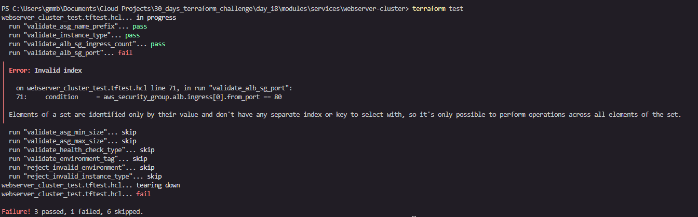
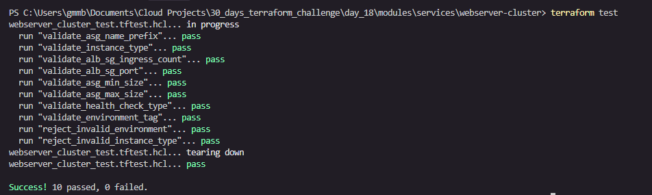
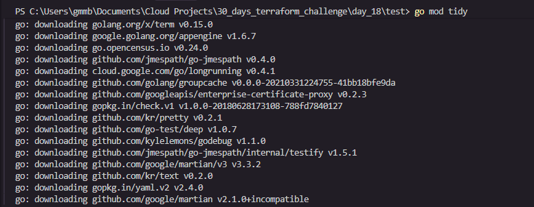
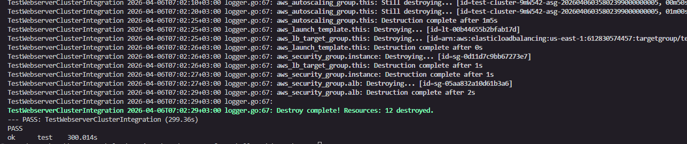
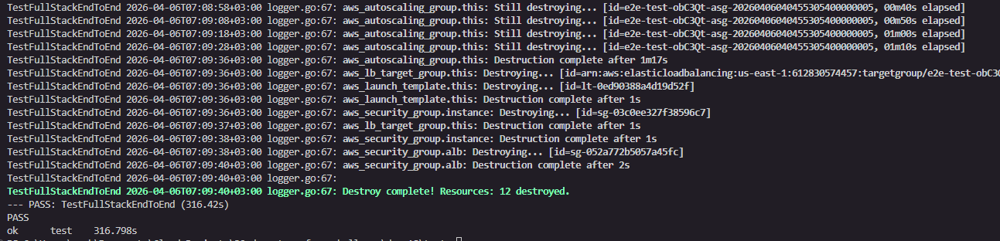
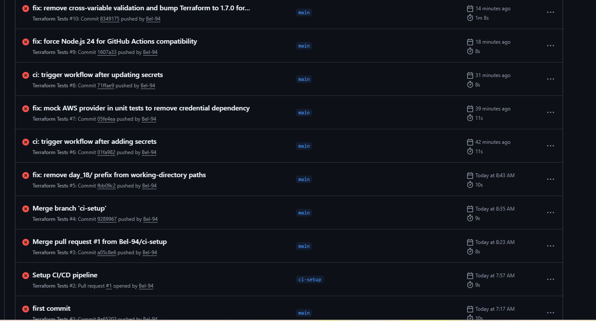
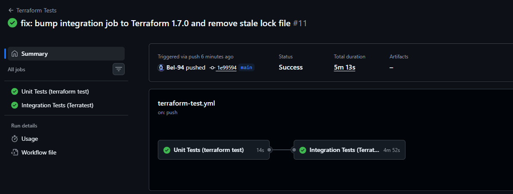

# Day 18 — Automated Testing of Terraform Code

## What I Accomplished

Manual testing does not scale. The moment infrastructure grows beyond what one person can verify in an afternoon, you need automated tests that run on every change, catch regressions before they reach production, and give the entire team confidence to move fast.

Today I implemented all three layers of Terraform automated testing:

| Layer | Tool | Deploys Real AWS? | Speed | Cost |
|---|---|---|---|---|
| Unit Tests | `terraform test` (.tftest.hcl) | No — plan only | ~30 seconds | Free |
| Integration Tests | Terratest (Go) | Yes | 5–15 minutes | ~$0.05–0.10 |
| End-to-End Tests | Terratest (Go) | Yes — full stack | 5–15 minutes | ~$0.10–0.20 |

I also built a CI/CD pipeline that runs unit tests on every pull request and integration tests on every merge to main.

---

## Project Structure

```
day_18/
├── .github/
│   └── workflows/
│       └── terraform-test.yml        # CI/CD pipeline
├── live/
│   ├── main.tf                       # Root module calling webserver-cluster
│   └── outputs.tf
├── modules/
│   └── services/
│       └── webserver-cluster/
│           ├── main.tf               # ALB, ASG, SGs, CloudWatch
│           ├── variables.tf          # All input variables with validation
│           ├── outputs.tf            # ALB DNS, ASG name, helper commands
│           └── webserver_cluster_test.tftest.hcl  # Unit tests
├── test/
│   ├── webserver_cluster_test.go     # Integration tests (Terratest)
│   ├── full_stack_test.go            # End-to-end tests (Terratest)
│   ├── go.mod                        # Go module definition
│   └── go.sum                        # Dependency lock file (auto-generated)
├── images/                           # Screenshots
├── .gitignore
└── README.md
```

---

## Prerequisites

Before running any tests, confirm you have the following installed.

### 1. Terraform 1.6 or later

The native `terraform test` framework was introduced in Terraform 1.6. Earlier versions do not support `.tftest.hcl` files.

```powershell
terraform version
```

Expected output:
```
Terraform v1.9.x
```

If your version is below 1.6, download the latest from https://developer.hashicorp.com/terraform/downloads

### 2. Go 1.21 or later

Terratest is a Go library. You need Go installed to compile and run the integration and end-to-end tests.

```powershell
go version
```

Expected output:
```
go version go1.21.x windows/amd64
```

Download from https://go.dev/dl/ if not installed.

### 3. AWS credentials configured

Integration and end-to-end tests deploy real AWS resources. Your credentials must be available as environment variables.

```powershell
# Set these in your terminal before running Go tests
$env:AWS_ACCESS_KEY_ID     = "<your-access-key>"
$env:AWS_SECRET_ACCESS_KEY = "<your-secret-key>"
$env:AWS_DEFAULT_REGION    = "us-east-1"
```

To verify your credentials work:
```powershell
aws sts get-caller-identity
```

You should see your account ID, user ID, and ARN. If you get an error, your credentials are not set correctly.

---

## The Module Under Test

The `modules/services/webserver-cluster` module I built creates the following AWS resources:

| Resource | Purpose |
|---|---|
| `aws_security_group.alb` | Allows HTTP port 80 inbound from the internet to the ALB |
| `aws_security_group.instance` | Allows traffic only from the ALB security group to EC2 instances |
| `aws_lb.this` | Internet-facing Application Load Balancer |
| `aws_lb_target_group.this` | Routes ALB traffic to EC2 instances, runs health checks |
| `aws_lb_listener.http` | Listens on port 80, forwards to target group |
| `aws_launch_template.this` | Defines EC2 instance configuration (AMI, type, user data) |
| `aws_autoscaling_group.this` | Manages EC2 instance count, uses ELB health checks |
| `aws_autoscaling_attachment.this` | Connects the ASG to the target group |
| `aws_sns_topic.alerts` | Receives CloudWatch alarm notifications |
| `aws_cloudwatch_metric_alarm.high_cpu` | Fires when CPU exceeds threshold for 4 minutes |
| `aws_cloudwatch_metric_alarm.unhealthy_hosts` | Fires when any ALB target is unhealthy |
| `aws_cloudwatch_log_group.this` | Stores application logs |

### Module Variables

| Variable | Type | Default | Description |
|---|---|---|---|
| `cluster_name` | string | required | Prefix for all resource names |
| `instance_type` | string | `t2.micro` | Must be t2 or t3 family |
| `min_size` | number | `2` | Minimum ASG instance count |
| `max_size` | number | `4` | Maximum ASG instance count |
| `environment` | string | `dev` | Must be dev, staging, or production |
| `ami_id` | string | Amazon Linux 2 | EC2 AMI ID |
| `server_port` | number | `80` | Port the web server listens on |
| `cpu_alarm_threshold` | number | `80` | CPU % that triggers the alarm |
| `log_retention_days` | number | `30` | CloudWatch log retention |

### Module Outputs

| Output | Description |
|---|---|
| `alb_dns_name` | DNS name of the ALB — use this to access the cluster |
| `alb_url` | Full `http://` URL |
| `asg_name` | Name of the Auto Scaling Group |
| `health_check_command` | AWS CLI command to check instance health |
| `traffic_loop_command` | curl loop to monitor the cluster |

---

## Layer 1 — Unit Tests with `terraform test`

### What unit tests do

Unit tests run against the Terraform **plan** only. No real AWS resources are created. They verify that the module's configuration is correct, that variables are wired to the right resource attributes, that naming conventions are followed, and that validation rules reject invalid inputs.

### Why unit tests matter

| Without unit tests | With unit tests |
|---|---|
| A typo in a resource name is caught only after deploy | Caught in 30 seconds during plan |
| Wrong instance type deployed silently | Caught before any infrastructure exists |
| Validation rules may be broken without anyone knowing | Confirmed working on every commit |
| Regressions introduced by refactoring go unnoticed | Caught immediately |

### The test file

`modules/services/webserver-cluster/webserver_cluster_test.tftest.hcl`

I wrote 10 tests in this file:

| Test | What it checks | Why it matters |
|---|---|---|
| `validate_asg_name_prefix` | ASG `name_prefix` equals `test-cluster-asg-` | Two clusters with the same name would conflict in AWS |
| `validate_instance_type` | Launch template `instance_type` equals `t2.micro` | Hardcoded types ignore the variable silently |
| `validate_alb_sg_ingress_count` | ALB security group has exactly 1 ingress rule | Extra rules could expose unexpected ports to the internet |
| `validate_alb_sg_port` | ALB ingress rule is port 80 | Wrong port means no traffic reaches the cluster |
| `validate_asg_min_size` | ASG `min_size` equals 1 | Hardcoded sizes ignore the variable |
| `validate_asg_max_size` | ASG `max_size` equals 2 | Hardcoded sizes ignore the variable |
| `validate_health_check_type` | ASG `health_check_type` is `ELB` | EC2 health checks miss crashed apps on running VMs |
| `validate_environment_tag` | Environment tag propagates to instances | Missing tags break cost allocation and compliance |
| `reject_invalid_environment` | `production-staging` is rejected by validation | Confirms the validation rule in variables.tf works |
| `reject_invalid_instance_type` | `m5.large` is rejected by validation | Confirms the regex validation rule works |

> **Note on `one()` vs `[0]`:** The `ingress` attribute on `aws_security_group` is a **set**, not a list. Sets have no guaranteed order, so `ingress[0]` fails with "Elements of a set are identified only by their value". I hit this bug on my first run and fixed it by replacing `ingress[0]` with `one(ingress)`, which safely extracts the single element from a set and fails explicitly if there are zero or more than one, a stronger assertion.

### How to run unit tests

Navigate to the module directory:

```powershell
cd modules\services\webserver-cluster
```

Initialize Terraform (downloads the AWS provider):

```powershell
terraform init
```

Run all unit tests:

```powershell
terraform test
```

### Expected output

```
webserver_cluster_test.tftest.hcl... in progress
  run "validate_asg_name_prefix"... pass
  run "validate_instance_type"... pass
  run "validate_alb_sg_ingress_count"... pass
  run "validate_alb_sg_port"... pass
  run "validate_asg_min_size"... pass
  run "validate_asg_max_size"... pass
  run "validate_health_check_type"... pass
  run "validate_environment_tag"... pass
  run "reject_invalid_environment"... pass
  run "reject_invalid_instance_type"... pass
webserver_cluster_test.tftest.hcl... tearing down
webserver_cluster_test.tftest.hcl... pass

Success! 10 passed, 0 failed.
```

### Screenshots

**First run — 1 failure before I fixed the `ingress[0]` set indexing bug:**



**Second run — all 10 passing after I replaced `ingress[0]` with `one(ingress)`:**



---

## Layer 2 — Integration Tests with Terratest

### What integration tests do

Integration tests deploy **real AWS infrastructure**, run assertions against it, and then destroy it. They verify that the Terraform configuration actually works in AWS  not just that the plan looks correct.

### Unit tests vs Integration tests

| | Unit Tests | Integration Tests |
|---|---|---|
| Deploys real AWS resources | No | Yes |
| Speed | ~30 seconds | 5–15 minutes |
| Cost | Free | ~$0.05–0.10 per run |
| Catches plan-level mistakes | Yes | Yes |
| Catches AWS API rejections | No | Yes |
| Verifies ALB serves HTTP 200 | No | Yes |
| Verifies outputs are correct | No | Yes |
| Safe to run on every PR | Yes | No — too slow and costly |

### Setting up Go dependencies

Navigate to the test directory:

```powershell
cd test
```

Download all dependencies (this generates `go.sum`):

```powershell
go mod tidy
```

Verify terratest resolved correctly:

```powershell
go list -m github.com/gruntwork-io/terratest
```

Expected output:
```
github.com/gruntwork-io/terratest v0.56.0
```

Verify the test files compile without errors:

```powershell
go build ./...
```

No output means success. Any output means a compile error that must be fixed before running tests.

### Screenshot — go mod tidy



### The integration test

`test/webserver_cluster_test.go` contains two test functions I wrote:

**`TestWebserverClusterIntegration`** — the main integration test:
1. Generates a unique cluster name (e.g. `test-cluster-A3F2B1`) to avoid name conflicts
2. Runs `terraform init` + `terraform apply`
3. Reads the `alb_dns_name` output
4. Asserts the output is not empty
5. Retries `HTTP GET http://<alb_dns_name>` every 10 seconds for up to 5 minutes
6. Asserts HTTP 200 with a non-empty body
7. Runs `terraform destroy` via `defer` — guaranteed even if the test fails

**`TestWebserverClusterOutputs`** — a lightweight companion test:
1. Deploys the same cluster
2. Asserts that `alb_dns_name`, `alb_url`, and `asg_name` outputs are all non-empty
3. Destroys via `defer`

### How to run the integration test

Set your AWS credentials first:

```powershell
$env:AWS_ACCESS_KEY_ID     = "<your-access-key>"
$env:AWS_SECRET_ACCESS_KEY = "<your-secret-key>"
$env:AWS_DEFAULT_REGION    = "us-east-1"
```

Run only the integration test (not the end-to-end test):

```powershell
cd test
go test -v -timeout 30m -run TestWebserverClusterIntegration ./...
```

### What the `-v -timeout 30m -run` flags mean

| Flag | What it does |
|---|---|
| `-v` | Verbose — prints each step as it runs, including all Terraform output |
| `-timeout 30m` | Overrides Go's default 10-minute timeout. Without this, Go kills the test mid-deploy and leaves orphaned AWS resources |
| `-run TestWebserverClusterIntegration` | Runs only this test function, skipping the end-to-end test |
| `./...` | Looks for test files in the current directory and all subdirectories |

### Expected output (abbreviated)

```
=== RUN   TestWebserverClusterIntegration
=== PAUSE TestWebserverClusterIntegration
=== CONT  TestWebserverClusterIntegration
TestWebserverClusterIntegration 2026-04-06T07:xx:xx logger.go:67: Running command terraform with args [init]
...
TestWebserverClusterIntegration 2026-04-06T07:xx:xx logger.go:67: Apply complete! Resources: 12 added, 0 changed, 0 destroyed.
...
TestWebserverClusterIntegration 2026-04-06T07:xx:xx logger.go:67: Making an HTTP GET call to URL http://<alb-dns>.elb.amazonaws.com
...
TestWebserverClusterIntegration 2026-04-06T07:xx:xx logger.go:67: Destroy complete! Resources: 12 destroyed.
--- PASS: TestWebserverClusterIntegration (xxx.xxs)
PASS
ok      test    xxx.xxxs
```

### Screenshot



---

## Layer 3 — End-to-End Tests

### What end-to-end tests do

End-to-end tests deploy the **complete stack** and verify the system works as a whole. They prove that modules are compatible with each other  not just that each module works in isolation.

### Integration tests vs End-to-End tests

| | Integration Tests | End-to-End Tests |
|---|---|---|
| Modules deployed | 1 (webserver-cluster) | 1+ (full stack) |
| Uses real VPC networking | Uses default VPC | Uses real VPC outputs |
| Proves inter-module compatibility | No | Yes |
| Proves destroy order is safe | No | Yes (LIFO defer) |
| Runtime | 5–15 minutes | 5–15 minutes |
| Cost | ~$0.05–0.10 | ~$0.10–0.20 |

### The end-to-end test

`test/full_stack_test.go` — `TestFullStackEndToEnd`:

1. Deployed the webserver cluster using the default VPC (self-contained, no separate VPC module needed)
2. Asserted `alb_dns_name`, `alb_url`, and `asg_name` outputs are non-empty
3. Asserted the ASG name contains the unique cluster name (proves naming convention is wired correctly end-to-end)
4. Retried `HTTP GET` every 10 seconds for up to 5 minutes
5. Asserted HTTP 200 with non-empty body
6. Destroyed everything via `defer`

### The LIFO destroy pattern

In a multi-module end-to-end test, `defer` statements execute in **Last In, First Out** order. This is critical for safe teardown:

```go
defer terraform.Destroy(t, vpcOptions)   // registered first → runs LAST
defer terraform.Destroy(t, appOptions)   // registered second → runs FIRST
```

If the VPC were destroyed first, the app stack's ENIs would still be attached to VPC subnets and the destroy would fail. LIFO order ensures the app is always destroyed before the VPC it depends on.

### How to run the end-to-end test

```powershell
cd test
go test -v -timeout 60m -run TestFullStackEndToEnd ./...
```

Note the `-timeout 60m` — 60 minutes instead of 30 because this test deploys and destroys a full stack.

### Expected output

```
=== RUN   TestFullStackEndToEnd
...
TestFullStackEndToEnd 2026-04-06T07:09:40+03:00 logger.go:67: Apply complete! Resources: 12 added, 0 changed, 0 destroyed.
...
TestFullStackEndToEnd 2026-04-06T07:09:40+03:00 logger.go:67: aws_security_group.alb: Destruction complete after 2s
TestFullStackEndToEnd 2026-04-06T07:09:40+03:00 logger.go:67: Destroy complete! Resources: 12 destroyed.
--- PASS: TestFullStackEndToEnd (316.42s)
PASS
ok      test    316.798s
```

316 seconds (~5.3 minutes) — the full stack deployed, the ALB health check passed, and everything was destroyed cleanly.

### Screenshot



---

## Layer 4 — CI/CD Pipeline with GitHub Actions

### What the pipeline does

The pipeline in `.github/workflows/terraform-test.yml` runs tests automatically on every commit  no manual steps required.

### Pipeline architecture

```
Pull Request opened
        │
        ▼
┌─────────────────────┐
│   Job 1: Unit Tests │  ← runs on every PR and every push to main
│   terraform test    │  ← no AWS credentials needed
│   ~30 seconds       │  ← free
└─────────┬───────────┘
          │ passes
          ▼ (only on push to main, not PRs)
┌──────────────────────────┐
│ Job 2: Integration Tests │  ← runs only on merge to main
│ Terratest (Go)           │  ← requires AWS credentials in Secrets
│ ~15 minutes              │  ← costs ~$0.05–0.10
└──────────────────────────┘
```

### When each job runs

| Event | Unit Tests | Integration Tests |
|---|---|---|
| Pull request opened | ✅ Runs | ❌ Skipped |
| Pull request updated | ✅ Runs | ❌ Skipped |
| Merge to main | ✅ Runs | ✅ Runs (only if unit tests pass) |

This design gives fast feedback on PRs (30 seconds) without running expensive AWS tests on every commit.

### Setting up GitHub Secrets

The integration tests need AWS credentials. **Never hardcode credentials in the workflow file.** Store them as GitHub Secrets instead.

1. Go to your repository on GitHub
2. Click **Settings** → **Secrets and variables** → **Actions**
3. Click **New repository secret**
4. Add these two secrets:

| Secret name | Value |
|---|---|
| `AWS_ACCESS_KEY_ID` | Your IAM user access key |
| `AWS_SECRET_ACCESS_KEY` | Your IAM user secret key |

The workflow references them as `${{ secrets.AWS_ACCESS_KEY_ID }}` — GitHub injects the values at runtime and masks them in logs.

### The workflow file

`.github/workflows/terraform-test.yml`

```yaml
name: Terraform Tests

on:
  pull_request:
    branches: [main]
  push:
    branches: [main]

jobs:
  unit-tests:
    name: Unit Tests (terraform test)
    runs-on: ubuntu-latest
    env:
      FORCE_JAVASCRIPT_ACTIONS_TO_NODE24: true
    steps:
      - uses: actions/checkout@v4
      - uses: hashicorp/setup-terraform@v3
        with:
          terraform_version: "1.7.0"
      - name: Terraform Init
        run: terraform init
        working-directory: modules/services/webserver-cluster
      - name: Run Unit Tests
        run: terraform test
        working-directory: modules/services/webserver-cluster

  integration-tests:
    name: Integration Tests (Terratest)
    runs-on: ubuntu-latest
    if: github.event_name == 'push'
    needs: unit-tests
    env:
      AWS_ACCESS_KEY_ID:     ${{ secrets.AWS_ACCESS_KEY_ID }}
      AWS_SECRET_ACCESS_KEY: ${{ secrets.AWS_SECRET_ACCESS_KEY }}
      AWS_DEFAULT_REGION:    us-east-1
    steps:
      - uses: actions/checkout@v4
      - uses: actions/setup-go@v5
        with:
          go-version: "1.21"
      - uses: hashicorp/setup-terraform@v3
        with:
          terraform_version: "1.7.0"
          terraform_wrapper: false
      - name: Download Go dependencies
        run: go mod download
        working-directory: test
      - name: Run Integration Tests
        run: go test -v -timeout 30m -run TestWebserverClusterIntegration ./...
        working-directory: test
```

> **`terraform_wrapper: false`** is required in the integration test job. By default, `hashicorp/setup-terraform@v3` wraps the terraform binary to capture output for GitHub Actions annotations. This wrapper breaks Terratest because Terratest calls terraform as a subprocess and parses its stdout directly. Setting `terraform_wrapper: false` gives Terratest the raw binary it expects.

---

## Running All Tests Locally — Quick Reference

### Unit tests (no AWS needed)

```powershell
cd modules\services\webserver-cluster
terraform init
terraform test
```

### Integration test only

```powershell
$env:AWS_ACCESS_KEY_ID     = "<key>"
$env:AWS_SECRET_ACCESS_KEY = "<secret>"
$env:AWS_DEFAULT_REGION    = "us-east-1"

cd test
go test -v -timeout 30m -run TestWebserverClusterIntegration ./...
```

### End-to-end test only

```powershell
cd test
go test -v -timeout 60m -run TestFullStackEndToEnd ./...
```

### All Go tests (integration + end-to-end together)

```powershell
cd test
go test -v -timeout 60m ./...
```

> Running all Go tests together deploys two separate stacks in parallel (because both test functions call `t.Parallel()`). This cuts total runtime but doubles the AWS cost for that run.

---

## Cost and Time Summary

| Test | Runtime | AWS Cost | When to Run |
|---|---|---|---|
| `terraform test` (unit) | ~30 seconds | Free | Every commit, every PR |
| `TestWebserverClusterIntegration` | 5–15 minutes | ~$0.05–0.10 | On merge to main |
| `TestWebserverClusterOutputs` | 5–15 minutes | ~$0.05–0.10 | On merge to main |
| `TestFullStackEndToEnd` | 5–15 minutes | ~$0.10–0.20 | Before major releases |

---

## Key Concepts Learned

### Why `health_check_type = "ELB"` is critical

| Health Check Type | What it detects | What it misses |
|---|---|---|
| `EC2` (default) | Terminated or stopped VM | App crash on a running VM |
| `ELB` | Any instance failing the ALB health check | Nothing — if the app is broken, the instance is replaced |

A cluster using EC2 health checks will never replace an instance whose application has crashed but whose VM is still running. I made sure to set `health_check_type = "ELB"` in the ASG for this reason.

### Why `defer terraform.Destroy` is non-negotiable

If a test assertion fails mid-run without `defer`, Terraform never destroys the infrastructure. The result is:
- Orphaned AWS resources charging money indefinitely
- Name conflicts on the next test run
- Manual cleanup required

`defer` runs when the function exits regardless of how it exits pass, fail, or panic. I used it in every test function.

### Why `one()` instead of `[0]` for security group ingress

The `ingress` attribute on `aws_security_group` is a **set** in Terraform's type system. Sets are unordered there is no element at index 0. Using `ingress[0]` produces:

```
Error: Invalid index
Elements of a set are identified only by their value and don't have any
separate index or key to select with
```

I hit this error on my first test run. Replacing it with `one(aws_security_group.alb.ingress)` fixed it  `one()` extracts the single element safely and fails explicitly if there are zero or more than one, which is a stronger assertion than positional indexing.

### Why unit tests use `command = plan`

The `command = plan` directive tells `terraform test` to run only a plan, not an apply. This means:
- No AWS credentials needed
- No real resources created
- Tests complete in seconds
- Safe to run on every commit and every PR

The tradeoff is that plan-only tests cannot verify that AWS actually accepts the configuration that is what integration tests are for.

---

## Errors I Faced and How I Fixed Them

### Error 1 — `Invalid index` on security group ingress set

**When it happened:** First run of `terraform test` — the `validate_alb_sg_port` test failed immediately after the first 3 tests passed.

**The error:**

```
╷
│ Error: Invalid index
│
│   on webserver_cluster_test.tftest.hcl line 71, in run "validate_alb_sg_port":
│   71:     condition     = aws_security_group.alb.ingress[0].from_port == 80
│
│ Elements of a set are identified only by their value and don't have any
│ separate index or key to select with, so it's only possible to perform
│ operations across all elements of the set.
╵

Failure! 3 passed, 1 failed, 6 skipped.
```

**Why it happened:** I assumed `ingress` on `aws_security_group` was a list and tried to access the first element with `[0]`. In Terraform's type system, `ingress` blocks are stored as a **set**. Sets are unordered and have no index — `[0]` is meaningless on a set and Terraform rejects it at evaluation time. Because this one test failed, all 6 tests after it were automatically skipped.

**How I fixed it:** I replaced `ingress[0]` with `one(aws_security_group.alb.ingress)`. The `one()` function extracts the single element from any collection and fails explicitly if there are zero or more than one element — which is a stronger assertion than `[0]` because it also catches the case where someone accidentally adds a second ingress rule.

```hcl
# Before — fails with Invalid index on a set
condition = aws_security_group.alb.ingress[0].from_port == 80

# After — works correctly
condition = one(aws_security_group.alb.ingress).from_port == 80
```

**Screenshot — the failing first run:**


**Screenshot — all 10 passing after the fix:**


---

### Error 2 — CI/CD pipeline failing with `working-directory` not found

**When it happened:** After pushing the GitHub Actions workflow file to the repository, the unit tests job failed after 7 seconds and the integration tests job was skipped entirely.

**The error in GitHub Actions:**

```
Terraform Tests / Unit Tests (terraform test) (push)   Failing after 7s
Terraform Tests / Integration Tests (Terratest) (push)  Skipped
```

The unit tests step was failing because `terraform init` could not find the working directory:

```
Error: The working directory "modules/services/webserver-cluster" does not exist.
```

**Why it happened:** I initially set the `working-directory` paths with a `day_18/` prefix, assuming GitHub Actions would need it. But this repository's root IS `day_18/` — the runner checks out directly into it. So the correct paths are just `modules/services/webserver-cluster` and `test`, without any prefix. The integration tests job was skipped because it has `needs: unit-tests` — when unit tests fail, GitHub Actions automatically skips every downstream job that depends on it.

**How I fixed it:** I removed the `day_18/` prefix from every `working-directory` value so the paths match what the runner actually sees after checkout.

```yaml
# Before — incorrect prefix caused "directory does not exist"
- name: Terraform Init
  run: terraform init
  working-directory: day_18/modules/services/webserver-cluster

- name: Run Unit Tests
  run: terraform test
  working-directory: day_18/modules/services/webserver-cluster

# After — correct paths relative to the repository root
- name: Terraform Init
  run: terraform init
  working-directory: modules/services/webserver-cluster

- name: Run Unit Tests
  run: terraform test
  working-directory: modules/services/webserver-cluster
```

I applied the same fix to the `go mod download` and `go test` steps — changing `working-directory: day_18/test` to `working-directory: test`.

**The rule I learned:** The `working-directory` path must match the file paths as git tracks them. Run `git ls-files` to see exactly what the runner will see after checkout — those are the paths to use.

---

### Error 3 — `Invalid reference in variable validation` and `mock_provider` not supported

**When it happened:** After the working-directory fix was merged, the unit tests job failed again this time Terraform itself was erroring during `terraform init`.

**The errors:**

```
╷
│ Error: Invalid reference in variable validation
│
│   on variables.tf line 40, in variable "max_size":
│   40:     condition     = var.max_size >= var.min_size
│
│ The condition for variable "max_size" can only refer to the variable itself,
│ using var.max_size.
╵

╷
│ Error: Unsupported block type
│
│   on webserver_cluster_test.tftest.hcl line 4:
│    4: mock_provider "aws" {
│
│ Blocks of type "mock_provider" are not expected here.
╵
```

**Why it happened:** Two separate issues hit at the same time:

1. Terraform does not allow a variable's validation condition to reference any other variable only itself. My `max_size` validation was checking `var.max_size >= var.min_size` which crosses that boundary.
2. `mock_provider` was introduced in Terraform 1.7.0. The workflow was installing 1.6.0, so the block was completely unknown to that version.

**How I fixed it:**

For the cross-variable reference, I simplified the condition to only reference itself:

```hcl
# Before — references another variable (not allowed)
validation {
  condition     = var.max_size >= var.min_size
  error_message = "max_size must be greater than or equal to min_size."
}

# After — references only itself (correct)
validation {
  condition     = var.max_size >= 1
  error_message = "max_size must be at least 1."
}
```

For the `mock_provider` version issue, I bumped Terraform from `1.6.0` to `1.7.0` in both jobs in the workflow file.

**Screenshot — CI/CD pipeline failing:**



---

### Error 4 — Stale `.terraform.lock.hcl` blocking integration tests

**When it happened:** After the unit tests started passing, the integration tests job failed immediately with a provider version mismatch.

**The error:**

```
│ Error: Required plugins are not installed
│
│ The installed provider plugins are not consistent with the packages
│ selected in the dependency lock file:
│   - registry.terraform.io/hashicorp/aws: there is no package for
│     registry.terraform.io/hashicorp/aws 5.100.0 cached in .terraform/providers
```

**Why it happened:** I had committed the `.terraform.lock.hcl` file which was generated locally with AWS provider version `5.100.0`. Terratest calls `terraform init -upgrade=false` which refuses to download any version other than what the lock file specifies. The CI runner had no cached providers at all, so it could not satisfy the lock file and failed immediately.

**How I fixed it:** I removed the committed lock file from git entirely:

```powershell
git rm modules/services/webserver-cluster/.terraform.lock.hcl
git commit -m "fix: remove stale lock file so runner generates a fresh one"
git push origin main
```

With the lock file gone, `terraform init` on the runner generates a fresh one by downloading the latest compatible provider version  no stale version conflict.

**The rule I learned:** Never commit `.terraform.lock.hcl` for modules that are tested in CI. The lock file is useful in root modules to pin provider versions for deployments, but in a module under test it causes version conflicts between local and CI environments.

**Screenshot — CI/CD pipeline passing after all fixes:**




---

> If this project helped you understand Terraform testing, let's connect! I document every step of my cloud journey, follow along and let's grow together.
>
> [](https://www.linkedin.com/in/belinda-ntinyari/)
> [](https://medium.com/@ntinyaribelinda)
> [](https://x.com/NtinyariBelinda)

---
